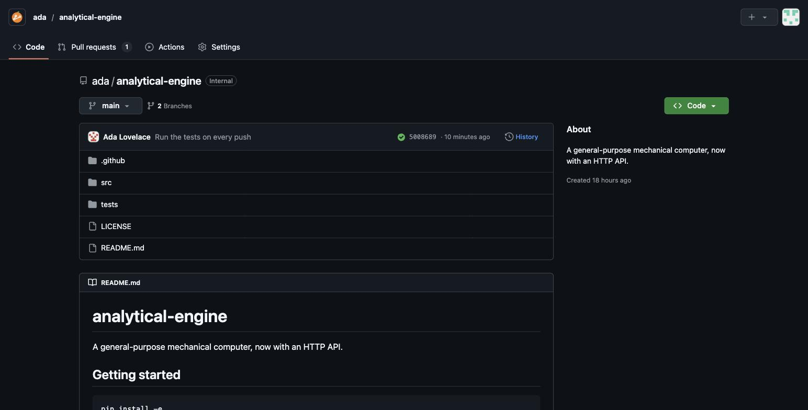
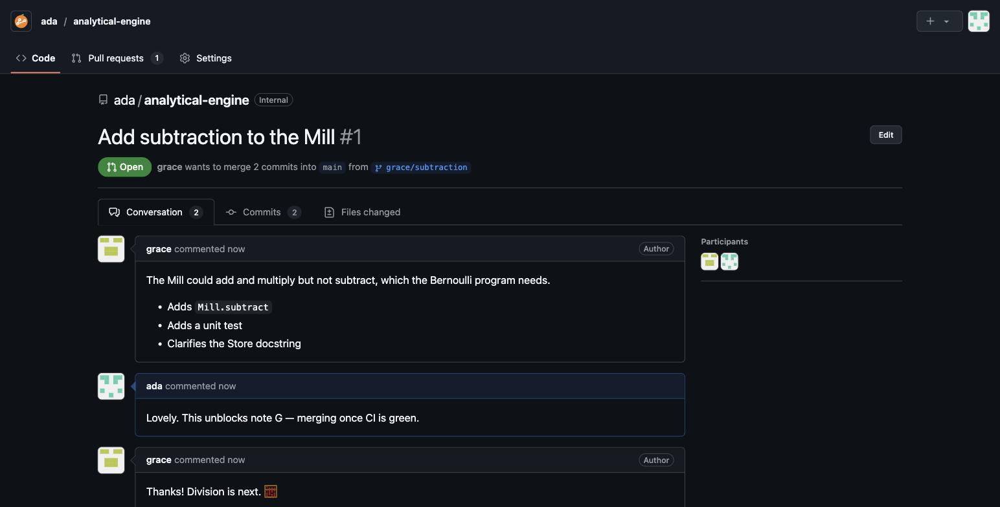
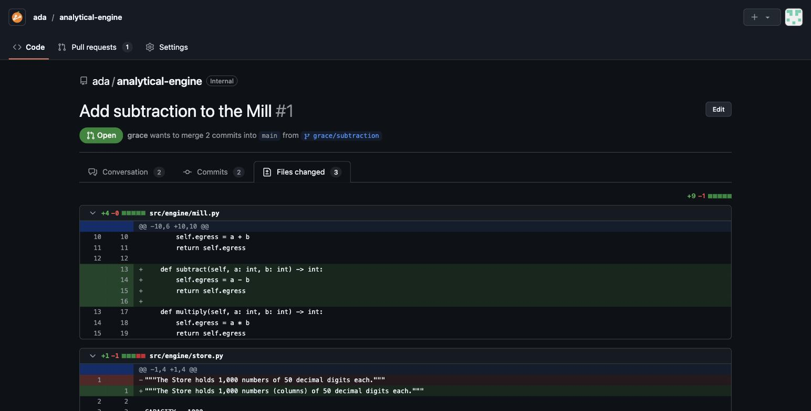
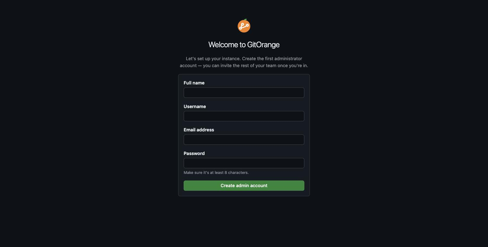
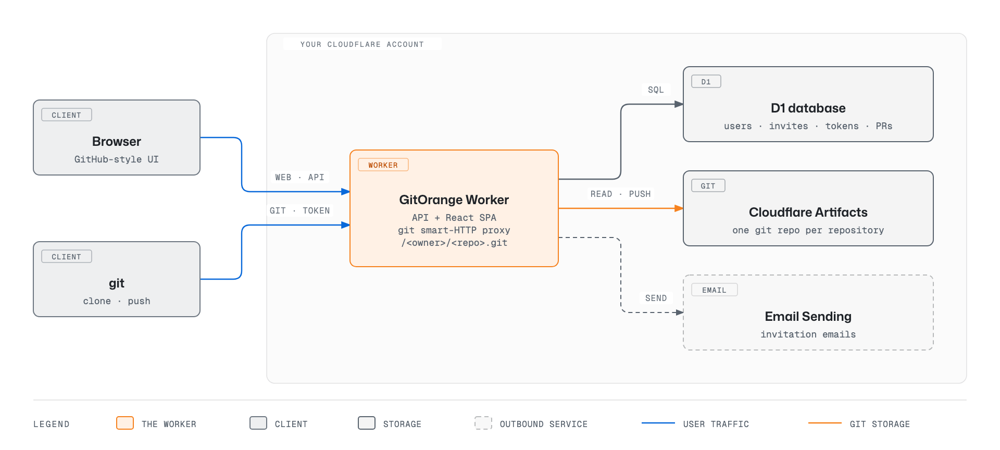

<p align="center">
  
</p>

<p align="center">
  <a href="https://github.com/choyiny/gitorange/actions/workflows/ci.yml"></a>
  <a href="LICENSE"></a>
  <a href="https://workers.cloudflare.com/"></a>
  <a href="https://developers.cloudflare.com/artifacts/"></a>
</p>

**A self-hosted GitHub for your team, with no servers to run.** GitOrange is a single-tenant git host in the spirit of GitHub Enterprise Server: the GitHub interface your team already knows, private to your organization, deployed as one Cloudflare Worker.

There is no VM, no disk to back up, and no git daemon to patch. Repositories live in [Cloudflare Artifacts](https://developers.cloudflare.com/artifacts/), Cloudflare's git-compatible storage. Everything else lives in D1.



## Who this is for

Small teams that want their code on infrastructure they control, with GitHub's familiar UI, and don't want to operate a GitHub Enterprise Server or GitLab instance. If you have a Cloudflare account on the Workers Paid plan with access to Artifacts, you can run GitOrange for a few dollars a month.

## Quickstart

**Prerequisites:** a Cloudflare account on the **Workers Paid** plan with **Artifacts** access ([closed beta — request access](https://forms.gle/DwBoPRa3CWQ8ajFp7)), a domain onboarded to [Cloudflare Email Sending](https://developers.cloudflare.com/email-service/) for invitation emails, and [Node.js](https://nodejs.org/) v20+ with yarn.

The fastest path is the Claude Code onboarding skill. It checks your account, creates the D1 database, fills in your config, sets secrets, runs migrations, and deploys:

```bash
git clone https://github.com/choyiny/gitorange.git
cd gitorange
claude   # then run /gitorange-onboarding
```

**First successful result:** your worker is live, and the first visit asks you to create the admin account. Create a repository, then `git push` to it with a personal access token.

Prefer to set it up by hand? See [Setup](docs/setup.md) (~7 steps).

## Documentation

Full docs live in **[docs/](docs/README.md)**: [Setup](docs/setup.md) · [Configuration](docs/configuration.md) · [Architecture](docs/architecture.md) · [Local development](docs/development.md)

## Screenshots

**Pull requests** — a conversation with Markdown comments, a merge box that detects conflicts, and merge-commit or squash merges.



**Files changed** — per-file unified diffs with diffstats.



**First run** — the first visitor creates the administrator; everyone after that joins by invitation.



## Features

- **First-run setup** — the first visitor creates the site admin. After that, sign-up is closed.
- **Email invitations** — admins invite teammates by email (or copy the link); invites are single-use and expire in 7 days.
- **Unlimited repositories** — create empty or with a README; browse files, Markdown READMEs, history, and per-commit diffs.
- **Syntax highlighting** — GitHub's color scheme for 35+ languages in file views and diffs, in light and dark mode.
- **Git over HTTPS** — `git clone https://your-host/<owner>/<repo>.git` with a personal access token as the password.
- **Pull requests** — open, comment, close, and reopen; view commits and files changed; merge with a merge commit or squash; delete the branch after merging.
- **Access control** — every member can read every repository; the owner, site admins, and collaborators added in repository settings can push and merge.

Intentionally not here yet: issues, forks, code review comments, Actions, and search. See the [roadmap](#roadmap).

## Architecture at a glance

<picture>
  <source media="(prefers-color-scheme: dark)" srcset="docs/diagrams/architecture-dark.png">
  
</picture>

Everything runs as a single Cloudflare Worker — no git server to operate. Git traffic is authenticated with a personal access token, then streamed to Artifacts with a short-lived token scoped to that one repository; merges are computed inside the Worker and pushed back as ordinary git objects. See [Architecture](docs/architecture.md) for the full breakdown.

## Known limitations

GitOrange is young. Before you rely on it, know that:

- **Merge conflicts are resolved locally.** Merging is file-level: if both branches changed the same file, the pull request reports a conflict and you merge `main` into your branch locally, then push. There's no in-browser conflict editor or line-level auto-merge yet.
- **Large diffs are truncated.** A diff shows at most 300 files, and files over ~512 KB (or binary files) are listed without their contents. File views skip highlighting above 300 KB and stop rendering above 1 MB (use **Raw**).
- **Very long histories are approximated.** Merge bases and pull request commit lists walk up to ~2,000 commits, which can mislabel commits on repositories with deep histories between branches.
- **No forks.** Pull requests are between branches of the same repository; contributors need to be collaborators.
- **The first visitor becomes the admin.** Until the admin account exists, anyone who can reach the URL can claim it. Complete setup right after deploying, before sharing the URL.
- **Artifacts is in closed beta.** Your Cloudflare account needs Artifacts access, and its APIs may change.

## How much does it cost?

**$5/month** for the Cloudflare Workers Paid plan, which Artifacts requires. Included each month: 10,000 Artifacts operations (a clone, fetch, push, or repo creation) and 1 GB of repository storage. Beyond that, Artifacts bills $0.15 per 1,000 operations and $0.50 per GB-month ([pricing](https://developers.cloudflare.com/artifacts/platform/pricing/)). D1 and Email Sending usage for a small team stays within the plan's included amounts.

## Roadmap

- Issues
- Line comments and reviews on pull requests
- Code search
- Organizations and teams

## Contributing

See [CONTRIBUTING.md](CONTRIBUTING.md). Security issues: see [SECURITY.md](SECURITY.md).

This repo ships a `CLAUDE.md` and Claude Code skills and hooks under `.claude/` that the maintainer uses when pairing with [Claude Code](https://claude.com/claude-code). They're harmless to ignore if you don't use Claude Code.

## License

[Apache License 2.0](LICENSE)

GitOrange is not affiliated with or endorsed by GitHub. "GitHub" is a trademark of GitHub, Inc. If you run a fork as a branded product, please rename it and replace the logo so users aren't confused about which project they're installing.
